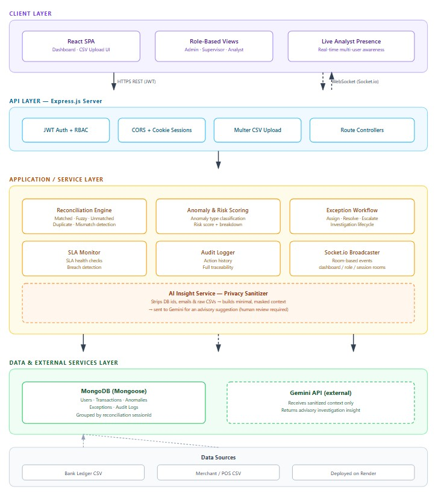

# Reconsta

**Payment Reconciliation & Anomaly Intelligence Platform**

Reconsta is a full-stack, single-tenant internal banking tool that automates the reconciliation of Bank Ledger transactions against Merchant/POS transactions. It detects anomalies, manages an investigation workflow with SLA tracking, streams real-time updates to every connected analyst, and generates privacy-aware AI insights to speed up root-cause analysis.

**Live demo:** [reconsta.onrender.com](https://reconsta.onrender.com/)

---

## Table of Contents

- [Overview](#overview)
- [Problem Statement](#problem-statement)
- [Key Features](#key-features)
- [Tech Stack](#tech-stack)
- [Architecture](#architecture)
- [Repository Structure](#repository-structure)
- [Roles & Permissions](#roles--permissions)
- [Getting Started](#getting-started)
  - [Prerequisites](#prerequisites)
  - [Backend Setup](#backend-setup)
  - [Frontend Setup](#frontend-setup)
- [Environment Variables](#environment-variables)
- [API Overview](#api-overview)
- [Real-Time Events (Socket.io)](#real-time-events-socketio)
- [AI Insight Privacy Design](#ai-insight-privacy-design)
- [Project Status](#project-status)
- [Roadmap](#roadmap)
- [Contributing](#contributing)
- [License](#license)
- [Author](#author)

---

## Overview

Manual reconciliation in finance teams is slow, error-prone, and hard to scale. Reconsta replaces spreadsheet-driven reconciliation with a structured, auditable workflow purpose-built for internal operations teams — bank staff, supervisors, and analysts reviewing transaction batches from multiple sources.

The system groups uploaded records into a **reconciliation session**, runs automated matching and anomaly detection, and helps teams investigate, assign, escalate, and resolve exceptions with full traceability.

## Problem Statement

Common pain points in manual reconciliation include:

- Missing records, duplicate entries, and amount mismatches between ledgers
- Delayed settlement files and undetected SLA breaches
- Poor visibility across investigation work
- Time lost switching between spreadsheets, notes, and disconnected dashboards
- No structured way to prioritize high-risk cases

Reconsta addresses this with a single backend-driven workflow that ingests both transaction sources, reconciles them automatically, and surfaces the highest-risk cases first.

## Key Features

- **CSV Ingestion** — Upload Bank and POS transaction files for a single reconciliation session
- **Automated Reconciliation Engine** — Detects matched, fuzzy-matched, unmatched, duplicate, and mismatched transactions
- **Anomaly Detection & Risk Scoring** — Every anomaly is scored with a full risk breakdown
- **Exception Workflow** — Assignment, resolution, and escalation for flagged cases
- **SLA Monitoring** — Automated SLA checks with breach detection
- **Audit Logging** — Full action history for every investigation, reviewable by supervisors/admins
- **Real-Time Collaboration** — Socket.io-powered live dashboard and workflow updates across all connected analysts
- **AI-Powered Insights** — Gemini-generated, privacy-aware investigation suggestions per anomaly
- **Role-Based Access Control** — Distinct permission sets for Admin, Supervisor, and Analyst roles
- **Operational Dashboard** — Summary metrics, risk distribution, recent activity, and SLA health at a glance

## Tech Stack

| Layer | Technology |
|---|---|
| Frontend | React (MERN stack) |
| Runtime | Node.js |
| Backend Framework | Express.js |
| Database | MongoDB |
| ODM | Mongoose |
| Authentication | JWT (access + refresh tokens), cookie-based sessions |
| Real-Time Communication | Socket.io |
| AI | Gemini API |
| File Upload | Multer |
| CSV Parsing | csv-parse |
| Security | bcryptjs, cookie-parser, CORS |
| Deployment | Render |

## Architecture


The AI Insights layer sits alongside the exception workflow: sanitized, privacy-scrubbed anomaly context is sent to Gemini on demand to generate an advisory suggestion that helps analysts locate the likely fault area faster, without replacing human judgment.

## Repository Structure

This is a monorepo containing both the backend API and the frontend client.

| Path | Description |
|---|---|
| `reconsta-backend/` | Node.js/Express API, MongoDB models, reconciliation engine, Socket.io server, and Gemini integration |
| `reconsta-frontend/` | React client — dashboard, upload flow, anomaly/exception views, and real-time analyst UI |
| `.gitignore` | Root ignore rules for the monorepo |

### Backend structure (`reconsta-backend/`)

| Path | Purpose |
|---|---|
| `src/app.js` | Express app setup, middleware, routes, health endpoint |
| `src/server.js` | HTTP server bootstrap and Socket.io setup |
| `src/config/` | Environment and database configuration |
| `src/controllers/` | Request handlers for each module |
| `src/middleware/` | Authentication, role checks, error handling, upload handling |
| `src/models/` | Mongoose models — users, transactions, anomalies, exceptions, audit logs |
| `src/routes/` | API route definitions |
| `src/services/` | Reconciliation, matching, scoring, SLA, realtime, and Gemini logic |
| `src/socket/` | Socket.io server and event helpers |
| `src/utils/` | Shared helpers (error/response formatting) |
| `docs/backend-api-checklist.md` | API checklist and implementation notes |
| `scripts/seedAdmin.js` | Creates the initial admin user |
| `sample-data/` | Example Bank and POS CSV files |

## Roles & Permissions

| Role | Access | Responsibility |
|---|---|---|
| **Admin** | Full access — all modules, user registration, assignments, escalations, resolutions, dashboard, audit logs, AI insights | Manages the entire reconciliation operation |
| **Supervisor** | Dashboard, transactions, anomalies, exceptions, audit logs, SLA checks, reconciliation run, AI insights | Monitors workflow and oversees investigations |
| **Analyst** | Assigned exceptions, related anomaly details, exception history, AI insights for assigned cases | Investigates and resolves assigned work |

## Getting Started

### Prerequisites

- Node.js (LTS recommended)
- MongoDB instance (local or Atlas)
- A Gemini API key (for AI insight generation)

### Backend Setup

```bash
cd reconsta-backend
npm install
```

Create a `.env` file in `reconsta-backend/` (see [Environment Variables](#environment-variables)).

If you want an initial admin account, set the `SEED_ADMIN_*` variables and run:

```bash
node scripts/seedAdmin.js
```

Run the server:

```bash
npm run dev     # development
npm start        # production
```

Expected output:
```bash
    MongoDB connected
    Server is running on port 5000
```

### Frontend Setup

```bash
cd reconsta-frontend
npm install
npm run dev
```

Configure the frontend's API base URL to point at your running backend instance (see the frontend's own `.env`/config file).

## Environment Variables

Backend `.env` (in `reconsta-backend/`):

| Variable | Purpose |
|---|---|
| `PORT` | Server port |
| `MONGODB_URI` | MongoDB connection string |
| `CLIENT_URL` | Frontend origin allowed by CORS |
| `JWT_ACCESS_SECRET` | Secret for access tokens |
| `JWT_ACCESS_EXPIRE` | Access token lifetime |
| `JWT_REFRESH_SECRET` | Secret for refresh tokens |
| `JWT_REFRESH_EXPIRE` | Refresh token lifetime |
| `GEMINI_API_KEY` | Gemini API key for AI insights |
| `NODE_ENV` | Application environment |
| `SEED_ADMIN_NAME` | Optional seed admin name |
| `SEED_ADMIN_EMAIL` | Optional seed admin email |
| `SEED_ADMIN_PASSWORD` | Optional seed admin password |

## API Overview

Base path: `/api`

### Health

| Method | Endpoint | Description |
|---|---|---|
| GET | `/health` | Checks whether the backend is running |

### Auth

| Method | Endpoint | Description |
|---|---|---|
| POST | `/api/auth/login` | Logs in a user and creates an authenticated session |
| POST | `/api/auth/refresh-token` | Issues a new access token using a refresh token |
| GET | `/api/auth/me` | Returns the current logged-in user profile |
| POST | `/api/auth/logout` | Ends the current authenticated session |
| POST | `/api/auth/register` | Creates a new user (admin only) |

### Transactions

| Method | Endpoint | Description |
|---|---|---|
| POST | `/api/transactions/upload` | Uploads Bank and POS CSV files (`multipart/form-data`: `bankFile`, `posFile`) for one session |
| GET | `/api/transactions` | Returns transactions with filters and pagination |
| GET | `/api/transactions/sessions` | Returns uploaded transaction sessions |
| GET | `/api/transactions/session/:sessionId/summary` | Returns transaction counts for one session |
| GET | `/api/transactions/:id` | Returns a single transaction by id |

### Reconciliation

| Method | Endpoint | Description |
|---|---|---|
| POST | `/api/reconciliation/run` | Runs reconciliation for one `sessionId` and updates workflow state |

### Anomalies

| Method | Endpoint | Description |
|---|---|---|
| GET | `/api/anomalies` | Returns anomaly records with filtering |
| GET | `/api/anomalies/:id` | Returns one anomaly by id |
| PATCH | `/api/anomalies/:id/status` | Updates anomaly status |

### Exceptions

| Method | Endpoint | Description |
|---|---|---|
| GET | `/api/exceptions` | Returns exception records with filtering |
| GET | `/api/exceptions/:id` | Returns one exception by id |
| PATCH | `/api/exceptions/:id/assign` | Assigns an exception to a user |
| PATCH | `/api/exceptions/:id/resolve` | Marks an exception as resolved |
| PATCH | `/api/exceptions/:id/escalate` | Escalates an exception for higher review |

### Audit Logs

| Method | Endpoint | Description |
|---|---|---|
| GET | `/api/audit-logs` | Returns audit logs with filters and pagination |
| GET | `/api/audit-logs/exception/:exceptionId` | Returns audit history for one exception |

### SLA

| Method | Endpoint | Description |
|---|---|---|
| POST | `/api/sla/run` | Runs SLA checks and updates exception SLA status |

### Dashboard

| Method | Endpoint | Description |
|---|---|---|
| GET | `/api/dashboard/overview` | Summary counts for dashboard cards |
| GET | `/api/dashboard/metrics` | Grouped metrics for charts |
| GET | `/api/dashboard/risk` | Risk distribution and top risky anomalies |
| GET | `/api/dashboard/recent` | Recent anomalies and exceptions |
| GET | `/api/dashboard/sla` | SLA summary for operations monitoring |

### AI Insights

| Method | Endpoint | Description |
|---|---|---|
| GET | `/api/insights/anomalies/:anomalyId/insight` | Generates an AI-powered, privacy-aware investigation suggestion for one anomaly |

## Real-Time Events (Socket.io)

| Event | Description |
|---|---|
| `dashboard:updated` | Dashboard data changed |
| `reconciliation:completed` | Reconciliation finished for a session |
| `anomaly:created` | A new anomaly was created |
| `exception:created` | A new exception was created |
| `exception:assigned` | An exception was assigned |
| `exception:resolved` | An exception was resolved |
| `exception:escalated` | An exception was escalated |
| `sla:updated` | SLA status changed |
| `sla:breached` | An exception breached SLA |

**Socket rooms:**

| Room | Purpose |
|---|---|
| `user:USER_ID` | User-specific updates |
| `role:admin` | Admin-wide updates |
| `role:supervisor` | Supervisor-wide updates |
| `role:analyst` | Analyst-wide updates |
| `dashboard:operations` | Shared room for admin + supervisor dashboard updates |
| `session:SESSION_ID` | Updates scoped to one reconciliation session |

## AI Insight Privacy Design

Reconsta's AI layer is built for internal banking use and deliberately avoids sending sensitive raw data to Gemini:

| Privacy Rule | Implementation |
|---|---|
| No raw DB IDs | Internal MongoDB ids are never sent to the AI prompt |
| No employee emails | User email addresses are excluded from the AI payload |
| No full CSV upload | The full uploaded file is never sent to Gemini |
| Sanitized references only | Transaction and session references are masked before AI processing |
| Minimum required context | Only fields needed for investigation are sent |
| Human review first | AI responses are advisory only and never replace analyst judgment |

## Project Status

| Area | Status |
|---|---|
| Authentication | ✅ Implemented |
| Transaction upload | ✅ Implemented |
| Reconciliation engine | ✅ Implemented |
| Anomaly management | ✅ Implemented |
| Exception workflow | ✅ Implemented |
| Audit logging | ✅ Implemented |
| SLA monitoring | ✅ Implemented |
| Dashboard APIs | ✅ Implemented |
| Socket.io real-time updates | ✅ Implemented |
| Gemini AI insights | ✅ Implemented |

## Roadmap

- [ ] Multi-tenant support
- [ ] Configurable reconciliation matching rules per organization
- [ ] Exportable audit/compliance reports (PDF/CSV)
- [ ] Automated test suite (unit + integration) and CI pipeline
- [ ] API documentation via OpenAPI/Swagger

## Contributing

This is currently a single-maintainer academic/portfolio project. Issues and suggestions are welcome via [GitHub Issues](https://github.com/darshanbagade/reconsta/issues). If you'd like to contribute:

1. Fork the repository
2. Create a feature branch (`git checkout -b feature/your-feature`)
3. Commit your changes
4. Open a pull request describing the change

## License

No license has been published for this repository yet. All rights are reserved by the author unless a license file is added. If you intend to reuse this code, please open an issue to request licensing terms.

## Author

**Darshan Bagade**
GitHub: [@darshanbagade](https://github.com/darshanbagade)
Live project: [reconsta.onrender.com](https://reconsta.onrender.com/)